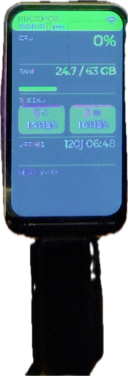

# ESP32-C6 Proxmox Dashboard

Dashboard temps réel sur écran LCD 1.47" (ST7789, 172×320 px) affichant les métriques d'un serveur Proxmox via son API REST HTTPS.

<p align="center">
  
</p>

## Matériel requis

| Composant | Référence |
|-----------|-----------|
| Microcontrôleur | Spotpear ESP32-C6 LCD 1.47" (ST7789V3, 172×320) |
| Connexion | USB-C (flashing + alimentation) |

> **Note GPIO** : CLK=GPIO7, MOSI=GPIO6, CS=GPIO14, DC=GPIO15, RST=GPIO21, BL=GPIO22.
> Ces broches correspondent au câblage physique du PCB Spotpear — **ne pas les inverser**.

## Fonctionnalités

- CPU Proxmox (%)
- RAM utilisée / totale (Go)
- Trafic réseau TX/RX (Mbps, calculé entre deux fetches)
- Uptime du nœud (jours/heures/minutes)
- Indicateur de connexion et horodatage de la dernière mise à jour
- Rafraîchissement configurable (défaut : 15 s)

## Prérequis logiciels

### 1. Dépendances système (macOS)

```bash
brew install cmake ninja dfu-util python3
```

### 2. ESP-IDF v5.4.1

```bash
mkdir -p ~/esp
cd ~/esp
git clone --recursive --branch v5.4.1 https://github.com/espressif/esp-idf.git
cd esp-idf
./install.sh esp32c6
```

Ajouter à `~/.zshrc` (ou lancer manuellement avant chaque session) :

```bash
source ~/esp/esp-idf/export.sh
```

### 3. Cloner ce dépôt

```bash
git clone https://github.com/Bono2007/ESP32-C6-LCD.git
cd ESP32-C6-LCD
```

## Configuration

### Créer `sdkconfig.defaults.local` (jamais commité)

Ce fichier contient les credentials. Il n'est **pas** versionné (voir `.gitignore`).

```ini
CONFIG_WIFI_SSID="NomDeTonReseau"
CONFIG_WIFI_PASSWORD="MotDePasse"
CONFIG_PROXMOX_HOST="192.168.1.10"
CONFIG_PROXMOX_PORT=8006
CONFIG_PROXMOX_NODE="pve"
CONFIG_PROXMOX_API_TOKEN="root@pam!tokenid=xxxxxxxx-xxxx-xxxx-xxxx-xxxxxxxxxxxx"
CONFIG_REFRESH_INTERVAL_MS=15000
```

### Créer un token API Proxmox

Dans l'interface web Proxmox : **Datacenter → API Tokens → Add**

- User : `root@pam` (ou un utilisateur dédié)
- Token ID : `esp32` (par exemple)
- Privilege Separation : **désactivé** (sinon ajouter les droits manuellement)

Le token s'affiche une seule fois : `root@pam!esp32=xxxxxxxx-...`

### Patcher le sdkconfig avec les credentials

ESP-IDF ne charge pas automatiquement `sdkconfig.defaults.local`. Appliquer les valeurs manuellement :

```bash
source ~/esp/esp-idf/export.sh
idf.py set-target esp32c6   # génère sdkconfig initial

# Appliquer les credentials depuis .local
while IFS='=' read -r key val; do
  [[ "$key" =~ ^# ]] && continue
  [[ -z "$key" ]] && continue
  val="${val%\"}"
  val="${val#\"}"
  sed -i '' "s|${key}=.*|${key}=\"${val}\"|" sdkconfig 2>/dev/null || true
done < sdkconfig.defaults.local

# Les valeurs numériques (PORT, INTERVAL) n'ont pas de guillemets
sed -i '' 's/CONFIG_PROXMOX_PORT="8006"/CONFIG_PROXMOX_PORT=8006/' sdkconfig
sed -i '' 's/CONFIG_REFRESH_INTERVAL_MS="15000"/CONFIG_REFRESH_INTERVAL_MS=15000/' sdkconfig
```

## Build, Flash, Monitor

```bash
source ~/esp/esp-idf/export.sh

idf.py build
idf.py -p /dev/cu.usbmodem1101 flash

# Lire les logs série (adapter le port)
python3 -c "
import serial, time
s = serial.Serial('/dev/cu.usbmodem1101', 115200, timeout=3)
end = time.time() + 60
while time.time() < end:
    line = s.readline().decode('utf-8', errors='replace').rstrip()
    if line: print(line)
s.close()
"
```

> Trouver le port USB : `ls /dev/cu.*`

## Architecture du code

```
main/
├── main.c              # app_main : orchestration des tâches FreeRTOS
├── display_driver.c/h  # Init SPI + ST7789 + LVGL
├── dashboard_ui.c/h    # Widgets LVGL (CPU, RAM, réseau, uptime)
├── proxmox_client.c/h  # Requête HTTPS API Proxmox + parsing JSON
├── wifi_manager.c/h    # Connexion WiFi STA avec scan diagnostic
├── proxmox_ca.h        # Certificat auto-signé embarqué (à regénérer si expiré)
├── lv_conf.h           # Configuration LVGL (résolution, couleurs, fonts)
├── Kconfig.projbuild   # Paramètres menuconfig (GPIO, credentials, intervalle)
└── idf_component.yml   # Dépendances managed components (lvgl ~8.3)
```

### Tâches FreeRTOS

| Tâche | Priorité | Stack | Rôle |
|-------|----------|-------|------|
| `lvgl_task` | 5 | 4096 | `lv_timer_handler()` toutes les 5 ms + mise à jour UI |
| `fetch_task` | 3 | 8192 | Requête HTTPS Proxmox toutes les N secondes |

### Flux de données

```
fetch_task ──HTTP──▶ proxmox_client_fetch()
                          │ JSON parsing
                          ▼
                     s_latest (protégé par s_data_mux)
                     s_data_ready = true
                          │
lvgl_task ◀── maybe_update_ui() lit s_latest
      │ dashboard_ui_update()
      │ lv_refr_now()          ← forçage du rendu immédiat
      ▼
   LVGL widgets
      │ flush_cb (SPI synchrone)
      ▼
   ST7789 LCD
```

## Paramètres LVGL et affichage

- Résolution : 172×320 px (LCD_H_RES × LCD_V_RES dans `display_driver.h`)
- Double buffer : 172×20 px × 2 (dans IRAM)
- Police : Montserrat 12, 16, 24 (activées dans `sdkconfig.defaults`)
- Inversion couleur active (`esp_lcd_panel_invert_color(true)`) — propre au ST7789V3
- Offset colonne : 34 px (`esp_lcd_panel_set_gap(34, 0)`) — contrôleur interne 240 px pour un panel 172 px

## Certificat Proxmox (TLS)

Proxmox utilise un certificat auto-signé. Le certificat **racine CA** est embarqué dans `proxmox_ca.h`.

**Renouveler le certificat** (si Proxmox est régénéré ou à l'expiration) :

```bash
python3 -c "
import ssl, socket, base64, textwrap
ctx = ssl.create_default_context()
ctx.check_hostname = False
ctx.verify_mode = ssl.CERT_NONE
with socket.create_connection(('IP_PROXMOX', 8006)) as s:
    with ctx.wrap_socket(s) as ss:
        der = ss.getpeercert(binary_form=True)
        b64 = base64.b64encode(der).decode()
        lines = textwrap.wrap(b64, 64)
        print('-----BEGIN CERTIFICATE-----')
        for l in lines: print(l)
        print('-----END CERTIFICATE-----')
"
```

> **Important** : Cette commande récupère le certificat feuille (leaf). Il faut le certificat **racine CA** de Proxmox, disponible via l'API :
> `curl -k https://IP:8006/api2/json/nodes/pve/certificates/info | python3 -m json.tool`
> Prendre l'entrée avec `"filename": "pve-root-ca.pem"`.

Copier le résultat dans `main/proxmox_ca.h` entre les guillemets de `PROXMOX_CA_PEM`, **en ajoutant `\n` à la fin de chaque ligne et `"..."` autour de chaque ligne**.

---

## Écueils rencontrés et solutions

Cette section documente les problèmes non triviaux rencontrés lors du développement, pour éviter de les reproduire sur d'autres projets similaires.

---

### 1. GPIO CLK et MOSI inversés (écran noir)

**Symptôme** : Backlight allumé, mais écran entièrement noir. Aucune erreur dans les logs.

**Cause** : La documentation Spotpear et les exemples génériques inversent CLK et MOSI pour ce PCB. La configuration par défaut ESP-IDF `CONFIG_LCD_CLK_GPIO=6` / `CONFIG_LCD_MOSI_GPIO=7` est incorrecte pour cette carte.

**Solution** : Le câblage physique du PCB Spotpear ESP32-C6 1.47" est :
- `GPIO7 = CLK (SCLK)`
- `GPIO6 = MOSI`

Corriger dans `Kconfig.projbuild` :
```
config LCD_CLK_GPIO
    default 7
config LCD_MOSI_GPIO
    default 6
```

---

### 2. Backlight activé après le test couleur (rien de visible)

**Symptôme** : Le test couleur passe, mais l'écran reste noir pendant le test, puis s'allume après.

**Cause** : Le GPIO backlight était initialisé après le test couleur et le rendu LVGL.

**Solution** : Activer le backlight **avant** tout rendu, juste après `esp_lcd_panel_disp_on_off(true)`. L'ordre correct dans `display_driver_init()` :
1. Init SPI + panel ST7789
2. `esp_lcd_panel_invert_color` + `set_gap` + `disp_on_off`
3. **`gpio_set_level(BL_GPIO, 1)`** ← ici
4. Init LVGL

---

### 3. Certificat TLS : leaf vs. CA racine

**Symptôme** : `MBEDTLS_ERR_X509_CERT_VERIFY_FAILED` ou connexion TLS refusée malgré un certificat embarqué.

**Cause** : Le certificat embarqué était le certificat feuille (leaf, `pve-ssl.pem`) au lieu du certificat racine CA (`pve-root-ca.pem`). mbedTLS vérifie la chaîne de certification — il faut le CA qui a signé le leaf, pas le leaf lui-même. De plus, les lignes PEM doivent faire exactement 64 caractères base64 — un formatage manuel produit des lignes de longueur incorrecte et génère `MBEDTLS_ERR_X509_INVALID_FORMAT (-0x2562)`.

**Solution** :
1. Récupérer le certificat CA via l'API Proxmox (pas via `openssl s_client`) :
   ```bash
   curl -k https://IP:8006/api2/json/nodes/pve/certificates/info | python3 -m json.tool
   # Prendre l'entrée filename="pve-root-ca.pem"
   ```
2. Formater le PEM avec Python pour garantir exactement 64 caractères par ligne :
   ```python
   import base64, textwrap
   b64 = "..."  # la valeur "pem" de l'API (sans les délimiteurs)
   for line in textwrap.wrap(b64, 64):
       print(f'    "{line}\\n"')
   ```

---

### 4. API Proxmox 9 : structure JSON modifiée

**Symptôme** : `parse_status failed` dans les logs, ou valeurs CPU/RAM toujours à 0.

**Cause** : Proxmox 9 a changé la structure de `/api2/json/nodes/{node}/status` :
- Avant : champs plats `mem`, `maxmem`, `netin`, `netout`
- Proxmox 9 : `memory` est un **objet** `{"used": ..., "total": ..., "available": ..., "free": ...}`, et les champs réseau `netin`/`netout` ont **disparu** de cet endpoint

**Solution** : Deux requêtes HTTPS séparées :
- `/nodes/{node}/status` → `cpu`, `uptime`, `memory.used`, `memory.total`
- `/nodes/{node}/netstat` → somme de `in`/`out` pour toutes les VMs

---

### 5. Valeurs réseau en JSON string (pas number)

**Symptôme** : `netin` et `netout` affichent des valeurs absurdes (ex. `17592186044415`) au lieu d'octets réels.

**Cause** : `/nodes/{node}/netstat` retourne les compteurs d'octets sous forme de **chaînes JSON** (`"97423981156"`) et non de nombres. `cJSON_GetNumberValue()` sur une string retourne `NaN`, et `(uint64_t)NaN` produit une valeur indéfinie.

**Solution** : Fonction `cjson_to_u64()` qui gère les deux types :
```c
static uint64_t cjson_to_u64(cJSON *item)
{
    if (!item) return 0;
    if (cJSON_IsNumber(item)) return (uint64_t)item->valuedouble;
    if (cJSON_IsString(item) && item->valuestring)
        return strtoull(item->valuestring, NULL, 10);
    return 0;
}
```

---

### 6. Affichage figé à 0% malgré des données correctes

**Symptôme** : Les logs série montrent `cpu=19%`, mais l'écran affiche toujours `0%`. Aucune erreur.

**Cause** : Deux problèmes combinés :

**6a. LVGL n'est pas thread-safe** : Appeler `dashboard_ui_update()` (qui appelle des fonctions LVGL) depuis une tâche différente de celle qui appelle `lv_timer_handler()` provoque une corruption silencieuse de l'état interne LVGL, même sur un processeur single-core (ESP32-C6), car `lvgl_task` (priorité 5) peut préempter `ui_update_task` (priorité 3) au milieu d'un `lv_label_set_text`.

**Solution 6a** : Toutes les opérations LVGL doivent se faire depuis **la même tâche** que `lv_timer_handler()`. Architecture finale : une seule tâche `lvgl_task` qui appelle `maybe_update_ui()` juste avant `lv_timer_handler()`. La tâche `fetch_task` ne touche **jamais** LVGL, elle écrit uniquement dans un buffer partagé protégé par mutex.

**6b. `lv_timer_handler()` ne redéclenche pas le rendu après un `lv_obj_invalidate()`** : Sur ESP32-C6, quand `lv_timer_handler()` est appelé en boucle toutes les 5 ms, le timer interne de rafraîchissement LVGL ne se déclenche pas systématiquement après une invalidation d'objet — probablement lié à l'interaction avec l'init WiFi qui a fragmenté le premier cycle de rendu.

**Solution 6b** : Appeler `lv_refr_now(NULL)` après chaque mise à jour UI pour forcer un rendu immédiat, sans attendre le timer interne LVGL :
```c
dashboard_ui_update(&ui);
lv_refr_now(NULL);   // ← indispensable
```

---

### 7. Buffer réponse HTTP trop petit pour certains endpoints

**Symptôme** : `parse failed` ou JSON tronqué sur certaines requêtes.

**Cause** : `/nodes/{node}/rrddata?timeframe=hour` retourne ~29 Ko, bien au-delà du buffer de 2048 octets. Le buffer statique tronque la réponse silencieusement.

**Solution** : Utiliser `/nodes/{node}/netstat` à la place (réponse ~1.5 Ko). En général, tester la taille des réponses API avec `curl` avant d'ajuster `RESPONSE_BUF_SIZE` dans `proxmox_client.c`.

---

## Adapter à un autre projet

Ce projet est une base réutilisable. Pour l'adapter :

1. **Autre source de données** : remplacer `proxmox_client.c` par n'importe quel client HTTP ESP-IDF. La `ui_data_t` dans `dashboard_ui.h` définit le contrat avec l'UI.

2. **Autre dashboard** : modifier `dashboard_ui.c` — les widgets LVGL sont créés dans `dashboard_ui_init()` et mis à jour dans `dashboard_ui_update()`.

3. **Autre board ST7789** : vérifier les GPIO dans `Kconfig.projbuild` (defaults) et ajuster `LCD_H_RES`/`LCD_V_ES` + l'offset `set_gap()` selon le panneau.

4. **LVGL v9** : l'API de `lv_disp_draw_buf` a changé en v9 — mettre à jour `idf_component.yml` (`version: "~9.0.0"`) et adapter `display_driver.c`. Vérifier aussi que `lv_refr_now` existe toujours ou trouver l'équivalent.

## Dépannage

| Symptôme | Cause probable | Solution |
|----------|---------------|----------|
| Écran noir avec backlight | CLK/MOSI inversés | Vérifier GPIO7=CLK, GPIO6=MOSI |
| Couleurs inversées | Inversion ST7789 | `esp_lcd_panel_invert_color(true/false)` |
| Image décalée | Offset colonne incorrect | Ajuster `set_gap(34, 0)` |
| Fetch échoue TLS | Certificat TLS expiré ou mauvais cert | Regénérer `proxmox_ca.h` avec le CA racine |
| Fetch échoue TLS | Formatage PEM incorrect | Utiliser `textwrap.wrap(b64, 64)` en Python |
| Fetch échoue réseau | Isolation WiFi client | Vérifier que le router autorise la communication entre clients |
| `parse_status failed` | API Proxmox 9 différente de v7/v8 | Voir écueil #4 — deux requêtes séparées |
| Valeurs réseau absurdes | cJSON string vs number | Voir écueil #5 — utiliser `strtoull` |
| Affichage figé à 0% | LVGL non thread-safe | Voir écueil #6 — tout dans `lvgl_task` + `lv_refr_now` |
| `CONFIG_LCD_*` indéfini | `Kconfig.projbuild` au mauvais endroit | Doit être dans `main/`, pas à la racine |
| Binaire trop grand | Partition factory trop petite | Ajuster `partitions.csv` |

## Licence

MIT
